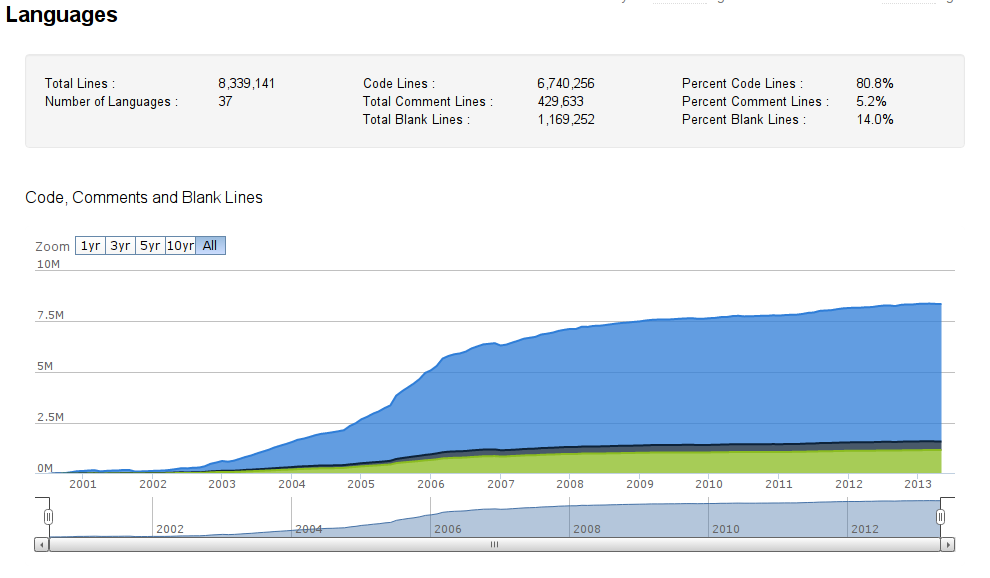
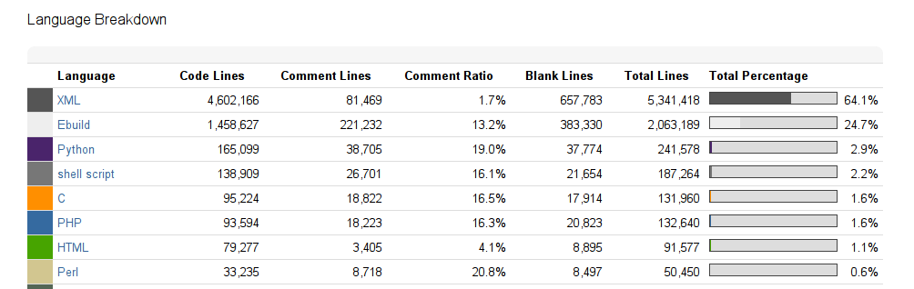
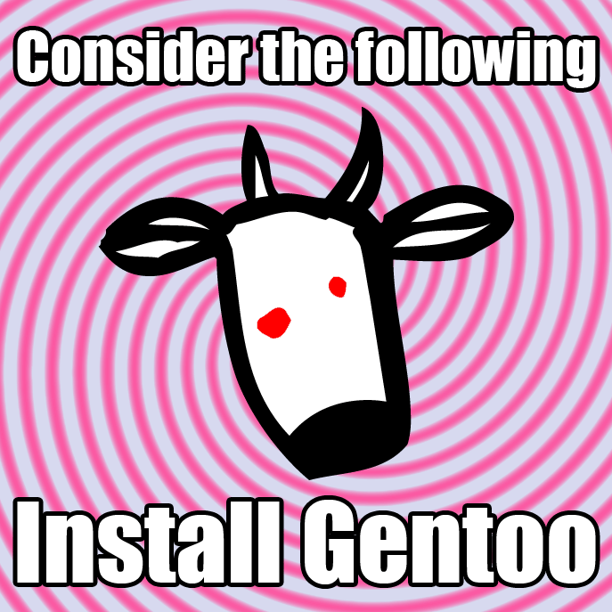

How to join Gentoo and why
=========

---

Why Gentoo works
---------

- Easy to contribute
- Good Support
- You can prioritize in coding and enjoing it!
- Made by developers for developers
- "teach a man how to fish" philosophy
- flexibility  
You can control which features of a given package are enabled and consequently how many dependencies get pulled in.  
- Stable  
Also if most of the package is more updated than in other binary distribution is same good in stability!  

---

Difficicult?!?
---------

**Amazing documentation is just waiting:**

- http://wiki.gentoo.org/wiki/Installation
- http://wiki.gentoo.org/wiki/Complete_Handbook

**You are already learning how to use, maintain and *contribute*!**  
  
- you always have the option of testing it before in a virtual machine or Containers  
(virualbox, kvm, xen, LXC and BHyVe?) is your friend

---

Freedom of choice
--------

- you can choose what to install and how to install it

---

How to contribute
--------

- Community
- Bugs
- Package Maintenance

---

Community
-------

- Forum
- IRC Channel
- Mailing lists
- wiki

---

Bugs
------

- Contributing in **Bugzilla**  
Good response, Simple and efficent. You don't have to lose time writing hundred of mail!

- Bugday  
http://bugday.gentoo.org/  
next bugday: 2013/November/2  
Bugday is a monthly online event that takes place every first Saturday of every month  in #gentoo-bugs in the Freenode network.
---

Package Maintenance
-------

- Report new packages and version bumps at our bugzilla.
- Make your own Layman repository on github! I did it and is amazing!

---

Staffing Needs
------

http://wiki.gentoo.org/wiki/Project:Gentoo/Staffing_Needs

---

Lines of code
--------
 

---

Language
-------

---

Install Gentoo!
---------

---

Question?
========

---

Slide Url:
========
- https://github.com/aliceinwire/JoinGentoo

My Email:
=========
- alice.ferrazzi@gmail.com

